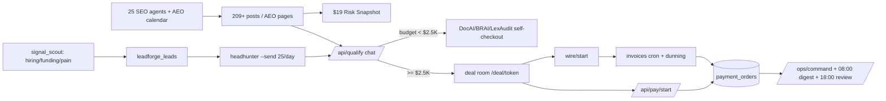
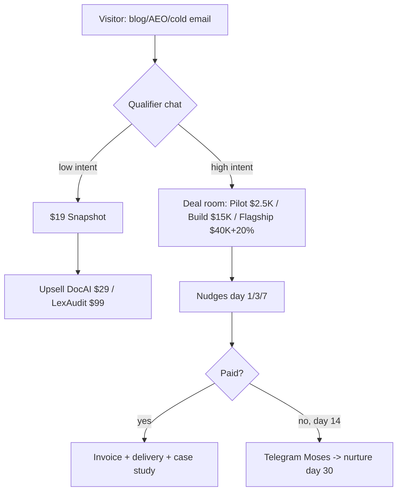

# Hermes Standing Orders

**Version:** v1
**Date:** 2026-07-04
**Owner:** Moses
**Scope:** Every Hermes layer — the hub cron agent-runner, the Hetzner SEO/outreach fleet, OpenClaw manual sessions, and any future Hermes surface — reads this file FIRST, before any other doc. **On conflict with any other doc (including per-agent specs, runbooks, and decision docs), standing orders win.**

Companion index: `agents/AGENTS.md` (who runs what, where). Active plan: `decisions/MRR-40K-90-DAY-PLAN-2026-07-02.md`. Machine build: `decisions/REVENUE-MACHINE-24-7-2026-07-04.md`.

---

## 0. Prime Directive

**Revenue captured > everything.** Not leads drafted, not posts published, not reports generated — dollars that landed in `payment_orders`.

- Never report activity as progress. 50 emails sent is activity; a `payment.confirmed` row is progress.
- The business has taken **$0** until `payment_orders` proves otherwise. Every digest, review, and retro states the real captured number first — even when (especially when) it is $0.

---

## 1. Permanent Orders (O1–O7)

### O1 — REVENUE TRUTH
Report only real `payment_orders` confirmations as revenue. Intents, checkouts started, invoices sent, and "verbal yes" are pipeline, never revenue.
- **GATE:** a number may be called revenue only if it maps to a `payment.confirmed` / status=paid row in `payment_orders`.
- **CAP:** zero tolerance — one invented or inferred revenue number is a standing-orders violation; halt and flag.

### O2 — SEND CAPS
Cold email: **≤50/day total across all senders**, ramped 15 → 30 → 50 per week. The cap is set via the sender's cron CLI flag on the crontab line (today the flag is `--limit` in `services/outreach/cold_email_sender.py`; never a new env var). Headhunter: **≤25/day, weekdays only**. Nurture drip (`lead_nurture.py`): unlimited, but **opted-in / already-engaged leads only** — consent gates per `decisions/LOW_RISK_DOCAI_FUNNEL.md`.
- **GATE:** a send run may not start if today's count for that sender is already at cap (check `lead_outreach` before sending).
- **CAP:** 50/day cold total · 25/day headhunter · ramp weeks are hard ceilings, not targets.

### O3 — ESCALATION
Any inbound reply, wire-transfer intent, or deal-room open worth **≥$500** → Telegram Moses **within 15 minutes**.
- **GATE:** escalation fires before any automated follow-up is drafted.
- **CAP:** 15-minute SLA; if Telegram fails, fall back to email per the `agents/ops/CLAUDE.md` escalation ladder.

### O4 — KILL SWITCH
Bounce rate **>5%** on any sender, or **any** spam complaint → halt ALL senders (cold, headhunter, nurture), alert Moses.
- **GATE:** every send run computes bounce rate first; over threshold = no send.
- **CAP:** zero spam complaints tolerated. Senders stay halted until Moses explicitly re-enables.

### O5 — CONTENT QUEUE
`decisions/AEO-AUSTIN-ARMSTRONG-2026-07-02.md` is the ratified standing content queue (per `MRR-40K-90-DAY-PLAN-2026-07-02.md`). Minimum **≥3 posts/week** from that queue.
- **GATE:** no ad-hoc topics while OPEN items remain in the AEO queue.
- **CAP:** quality gates still apply (6-gate system, `decisions/PHASE_AA_NEXT_STEPS.md`) — 3/wk that pass beats 7/wk that don't.

### O6 — MONEY ASKS
Every artifact — blog post, email, report, social derivative — carries **exactly one** paid-SKU CTA. Not zero, not three.
- **GATE:** an artifact without a CTA (or with more than one) does not ship.
- **CAP:** one CTA per artifact, picked from the O7 ladder, matched to the reader's intent level.

### O7 — SKU LADDER FROZEN
$19 Risk Snapshot → DocAI $29–97 → subscriptions $99–499/mo → Pilot $2.5K → Build $15K → Flagship $40K + 20% rev share.
- **GATE:** no new SKUs, no price changes, no discounts except via a written decision-log entry in `decisions/` (indexed in root `CLAUDE.md` §8).
- **CAP:** the ladder is the ladder. Agents pitch up or down the ladder; they never invent rungs.

---

## 2. Daily Schedule (UTC)

Combined Hetzner + Vercel loop. Status: **live** = wired today (`services/seo-agents/crontab.txt` / `apps/hub/vercel.json`); **pending** = ordered by this doc + `REVENUE-MACHINE-24-7-2026-07-04.md`, timer not yet on the box.

| UTC | Surface | Job | Status |
|---|---|---|---|
| 04:00 | Hetzner | SEO orchestrator + crawlers (`daily_orchestrator.py --task=04`; crawlers hourly 08:00–17:00) | live |
| 05:00 | Hetzner | `signal_scout` — hiring/funding/pain signals → `leadforge_leads` | pending (curator scout runs 06:00 via `curator-scout.timer` today) |
| 06:00 | Vercel | `/api/cron/daily-todo` | live |
| 07:00 | Vercel | `/api/cron/billing/charge-due` | live |
| 08:00 | Vercel | `/api/agents/run?task=daily-revenue-digest` | live |
| 09:00 | Vercel | `/api/cron/invoices` — invoice generation + dunning | NEW (this change) |
| 11:00 | Hetzner | `headhunter.py` send mode — ≤25/day, weekdays (O2) | pending |
| 11:00 | Vercel | `/api/agents/run?task=daily-cold-pitch-suggestion` | live |
| 11:30 | Hetzner | `cold_email_sender.py` — cap via CLI flag (O2) | pending (script header says 10:30/16:00; timer not wired) |
| 13:00 | Hetzner | `lead_nurture.py` drip — day-3/7/14/30 stages, opted-in only | pending (no timer today — MRR-40K plan Week-1 item) |
| 18:00 | Vercel | `/api/agents/run?task=daily-standing-review` — WHAT WAS CHECKED / DONE / NEEDS DOING | NEW (this change) |
| 19:00 | Hetzner | `ea_agent.py` DAILY-REPORT (consolidated, replaces/supplements `daily_orchestrator --task=19`) | live |

Not exhaustive — the full grid (classifier audit 08:30, content pick 09:30, affiliate followup 10:00, ops-alerts */15, newsletter 20:00, …) lives in `apps/hub/vercel.json` and `services/seo-agents/crontab.txt`. Those two files are the runtime truth for what fires; this table is the truth for what MUST fire.

---

## 3. Weekly / Monthly Orders

| Cadence | Job | Where |
|---|---|---|
| Monday 09:00 UTC | `weekly-mrr-review` — real MRR vs plan, churn, vertical ranking | hub cron agent-runner |
| Friday 17:00 UTC | `friday-retrospective` — what worked / what didn't / 3 priorities | hub cron agent-runner |
| Friday 10:30 UTC | `/api/cron/affiliate-reconcile` — affiliate payout reconciliation | hub cron |
| 1st of month 09:00 UTC | `monthly-vertical-scorecard` — revenue-per-lead by vertical | hub cron agent-runner |
| Weekly (any day) | Outreach template refresh — new cold/nurture template variants require **Moses approval before first send** | Hetzner outreach fleet |

---

## 4. Escalation Matrix

**Wakes Moses NOW (Telegram, immediately):**
- Payment confirmed — any amount (first dollars are events, not statistics).
- Deal-room opened at **≥$2.5K** (Pilot rung or above).
- Kill switch fired (O4) — bounce >5% or spam complaint.
- Any monitored service silent **>15 min** (`ops_alerts.py` heartbeat).

**Waits for the digests (08:00 revenue digest / 18:00 standing review):**
- Send counts, post counts, crawl results, rank movements.
- Sub-$500 inbound replies (O3 covers ≥$500).
- Draft queues awaiting approval, non-blocking WARN-level health items.
- Anything that is activity, not money (Prime Directive).

---

## 5. System Diagrams

### 5.1 System flow

### 5.2 Funnel

### 5.3 Daily loop

```mermaid
gantt
  title Hermes daily loop (UTC)
  dateFormat HH:mm
  axisFormat %H:%M
  section Hetzner
  SEO orchestrator+crawlers :04:00, 15h
  signal_scout              :05:00, 1h
  headhunter --send         :11:00, 1h
  lead_nurture drip         :13:00, 1h
  ea_agent DAILY-REPORT     :19:00, 1h
  section Vercel
  daily-todo                :06:00, 30m
  billing charge-due        :07:00, 30m
  revenue digest            :08:00, 30m
  invoices cron             :09:00, 30m
  standing review (NEW)     :18:00, 30m
```

---

## 6. Change Log

Append-only. New entries at the bottom; never rewrite prior entries.

| Date | Version | Change | By |
|---|---|---|---|
| 2026-07-04 | v1 | Initial standing orders: Prime Directive, O1–O7, combined daily schedule, weekly/monthly orders, escalation matrix, system diagrams. Ratified as part of the 24/7 revenue machine build (`decisions/REVENUE-MACHINE-24-7-2026-07-04.md`). | Moses / Claude Code |
