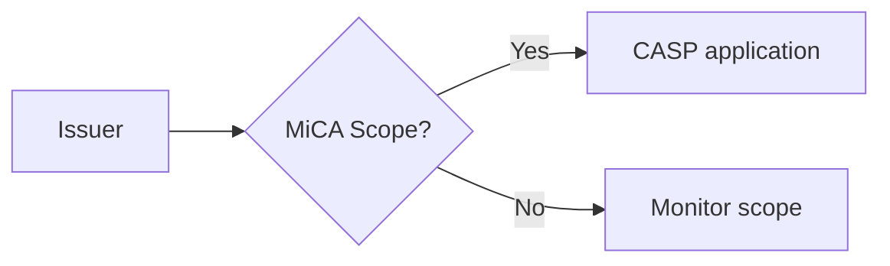

# Phase 2 — Programmatic SEO Engine (Autonomous, 5x/week)

**Objective:** Ship 5 high-quality, SEO-indexed, human-feeling crypto-compliance articles every week, fully autonomously, on `blog.bizlegal-ai.com` — on top of a pre-existing corpus of 177 thin SEO pages already in Supabase that we migrate + enrich, not regenerate.

## Pre-existing content inventory (discovered 2026-04-21 in Supabase ydghhcuuopqzgqcicubg.public.seo_pages)

- **177 rows total** — all `published=true`, only **145 deployed**, so **32 "locked"** (published-but-not-deployed)
- **Avg word count: 176** — thin content, needs enrichment to 1500+ for SEO quality
- **Jurisdiction distribution:** UAE 68 (perfect alignment with our UAE entity registration), EU 42, US 19, Global 17, Singapore 11, UK 10, Canada 2, Portugal 1
- **Regulation tags:** 74% untagged (131/177), SEC 9, MiCA 7, VARA 7, AML 6, FCA 5, MAS 5, GDPR 3
- **Page types:** null 113 (untyped), guide 54, template-guide 6, legal-explainer 4
- **Schema:** id, slug, title, meta_desc, h1, content (jsonb), jurisdiction, page_type, cta, cta_type, keywords[], word_count, reading_time, faq (jsonb), related_slugs[], regulation_tag, schema_type, published_at, updated_at

## Migration-first strategy (revised)

Priority order shifts from "generate new" to "migrate + normalize + enrich + scale":

**Day 1 (blog site + migration):**
- Scaffold Cloudflare Pages blog at `blog.bizlegal-ai.com`
- Build Supabase -> MDX exporter: pull all 177 rows, transform to frontmatter + body MDX, write to `bizlegal-ea/content/blog/{slug}.mdx`
- Deploy-state gate: only export rows where `published=true` (all 177 qualify)
- Preserve URLs: blog slug === seo_pages.slug (SEO continuity)
- Normalize jurisdictions: "united kingdom" / "united-kingdom" -> "uk"; "united states" / "united-states" -> "us"

**Day 2 (enrichment pipeline):**
- Build enrichment Worker: for each of 177 pages, Sonnet 4.6 expands body from ~176 words to 1500+ words using existing content as seed + cited primary sources + anti-AI-detection discipline
- Add Mermaid diagram + Nano Banana hero to each expanded page
- Haiku fact-check + SEO gates
- Tag backfill: Haiku classifies 131 untagged pages into regulation_tag taxonomy (SEC, MiCA, VARA, AML, FCA, MAS, GDPR, FATF, Travel Rule, OFAC, etc.)
- Page type backfill: 113 untyped pages classified as `guide` / `template-guide` / `legal-explainer` / `comparison` / `deadline-tracker` / `enforcement-brief`
- Rate limit: 20 pages/day to respect Anthropic tier limits; full backfill in ~9 days

**Day 3 (new content pipeline):**
- Cron triggers Mon-Fri 09:00 UTC -> 1 new post/day on top of the 177 migrated
- Topic harvester (Sun 06:00 UTC) seeds queue with latest regulator releases
- Same quality gates + AI-detection scrubbing as enrichment

**Day 4 (canonical sweep + SEO submission):**
- Canonical audit across bizlegal-ai.com + blog.bizlegal-ai.com
- Generate + submit sitemap to Google Search Console
- Schema.org verification via Google Rich Results Test

**Day 5 (activate + monitor):**
- Cron live
- CF Web Analytics on blog subdomain
- Weekly performance review cron (Mon 10:00 UTC -> Telegram digest)

## Writing workflow UNCHANGED (see existing sections below); only the TARGET changed.

**Status:** planning

**Stack (chosen per user: "you choose the automation/cron and tools"):**
- **Cron + orchestration** — Cloudflare Worker Cron Triggers (free)
- **Drafting** — Claude Sonnet 4.6 + anti-AI-detection prompt discipline
- **Critique + fact-check + AI-detection score** — Claude Haiku 4.5
- **Diagrams** — Mermaid (code-based, rendered at build time — free)
- **Infographics / hero images** — Gemini 2.5 Flash Image ("Nano Banana")
- **Publishing** — GitHub push to `bizlegal-ea/content/blog/` -> Cloudflare Pages rebuild
- **Host** — Cloudflare Pages on `blog.bizlegal-ai.com` (registered via Cloudflare DNS, independent of Vercel/Forge blocker)
- **Design reference** — https://cryptoclay.framer.website/blogs (layout, card-based listing, tag filters, editorial feel) — adapted to BizLegal-AI forge-v3-purple brand (light base, purple accent, Inter)
- **Topic sourcing** — Federal Register API + SEC EDGAR + FTC/FCC/FinCEN + EU Commission + FCA (all free), plus crypto-specific: SEC Crypto Assets page, FinCEN FinCEN-2019-A003, OFAC Cyber sanctions list, FATF VASP Travel Rule updates, MiCA transition tracker
- **Analytics** — Cloudflare Web Analytics (free, no cookies, GDPR-safe)
- **Canonical URLs** — every page emits rel=canonical tag pointing to its own absolute URL on `blog.bizlegal-ai.com`; cross-post canonical points back to blog if content syndicated

---

## Design — "cryptoclay-inspired" for BizLegal-AI

Reference: https://cryptoclay.framer.website/blogs

Adopted patterns (from reference):
- Card-based vertical list of posts
- Category tag pill on each card (News, Product, Invest, Crypto -> ours: Compliance, Regulatory, Jurisdiction, Intelligence, Enforcement)
- Clear hierarchy: section headline + subheadline + card grid
- Author + date attribution on each card
- Tag-based filter bar at top ("All Blog, News, Product, Invest, Crypto")
- Minimal, modern, editorial feel
- CTA placement throughout

Adapted to BizLegal-AI:
- Brand: forge-v3-purple tokens (`--accent #5b21b6`, `--accent-mid #6d28d9`, `--accent-lt #ede9fe`, light background `#f8f7ff`, Inter font)
- Tag taxonomy (5 top-level categories + dynamic per-post tags):
  - Top-level: `compliance`, `regulatory`, `jurisdiction`, `intelligence`, `enforcement`
  - Dynamic tags: regulation names (MiCA, VARA, MiFID, OFAC, SEC, CFTC, Travel-Rule, FATF, GDPR), jurisdictions (UAE, Singapore, Switzerland, EU, US, UK, HK), asset-types (stablecoins, DeFi, NFT, RWA, tokenization)
- Header: "BizLegal-AI Insights" section title + sub ("Stay ahead of crypto regulation across 50+ jurisdictions")
- Nav bar: Home, Blog (active), Jurisdictions, Products (-> `app.bizlegal-ai.com`), Pricing, Trust, Contact
- Products link target: `app.bizlegal-ai.com` (unified app hub per Moses directive)

---

## Canonical URL handling (SEO critical)

Every page emits:
```html
<link rel="canonical" href="https://blog.bizlegal-ai.com/{slug}" />
<meta property="og:url" content="https://blog.bizlegal-ai.com/{slug}" />
```

Worker also audits existing bizlegal-ai.com pages for canonical correctness as a one-time sweep ("fix canonical" task per user directive):
- Fetch sitemap.xml
- For each page, verify `rel=canonical` present and pointing to its own absolute URL
- Produce a gap report in `projects/bizlegal-seo-engine/canonical-audit.md`
- Fix gaps via patches to the bizlegal-ai repo (subject to user approval, not auto-merged)

---

## Anti-AI-detection discipline (enforced in prompts + critique)

Banned patterns (Haiku critique auto-rejects + asks Sonnet to rewrite):
- AI-typical phrases: "it's important to note", "moreover", "furthermore", "in conclusion", "navigating the landscape", "delve into", "dive deep", "in today's rapidly evolving"
- Over-balanced sentences (always 3 items, always "on one hand...on the other hand")
- Uniform paragraph length (vary 1-5 sentences)
- Excessive signposting ("First... Second... Third...") without narrative justification
- Generic openings ("In the world of crypto compliance...")
- Em-dash overuse (> 3 per 1000 words — flags as AI)
- Every sentence starting with subject (force variety)
- No concrete numbers, dates, jurisdictions, or case citations (AI hallucinates around specifics; humans use them)

Required human-feeling patterns:
- Cite specific cases: SEC v. Ripple (decision dates), Binance/CZ DOJ settlement, MiCA Level 2 RTS deadlines, FATF R.16 updates
- Use specific dollar/token amounts (e.g., "$4.3B DOJ settlement") not vague ("significant penalty")
- Use specific dates (e.g., "MiCA Article 43 effective 30 December 2024") not vague ("recently")
- Occasional first-person observation or opinion ("In my view, this is narrower than most teams assume")
- Occasional sentence fragments for emphasis ("Not this time.")
- Occasional casual phrasing amid professional tone ("That's the fine print everyone misses.")
- Contractions (don't, won't, can't) — AI tends to avoid; humans use them
- Occasional question -> answer rhythm
- At least one personal anecdote or case reference that feels researched, not templated

Haiku scores every draft 0-10 on "AI-detection risk":
- 0-3: human-feeling, ship
- 4-6: some AI telltales, Sonnet revises with specific feedback
- 7-10: heavy AI feel, full rewrite with new outline

---

## Content-building blocks per post

Every post ships with:

1. **Hero image** — Nano Banana, branded, specific to post topic (not generic)
2. **TL;DR box** — 3-5 bullets
3. **Body** — 1500-2500 words, 3+ H2s, 5+ H3s
4. **At least 1 Mermaid diagram** — flowchart, sequence diagram, or timeline for the regulatory concept
5. **At least 1 infographic-style Nano Banana image** — comparison table visualization, jurisdiction map, timeline infographic
6. **FAQ section** — 3-5 questions (triggers Google FAQ rich results)
7. **Related posts** — 2-3 internal links from `content/blog/` based on shared tags
8. **Primary source citations** — minimum 2 links to .gov, .eu, .int, official agency, or court opinion
9. **CTA block at end** — links to a product page on `app.bizlegal-ai.com` relevant to the post topic

---

## Architecture (unchanged from v1, extended)

```
                    .------------------------.
                    |  Weekly topic harvest  |
                    |  (Sun 06:00 UTC)       |
                    '------------------------'
                                 |
        Federal Register, SEC EDGAR, FTC/FCC/FinCEN,
        EU Commission, FCA, FATF, MiCA tracker, OFAC
                                 |
                                 v
                    .------------------------.
                    |  Topic queue           |
                    |  content/queue.json    |
                    '------------------------'
                                 |
                                 v  [Mon-Fri 09:00 UTC]
                    .------------------------.
                    |  Daily SEO worker      |
                    '------------------------'
                                 |
                  1. Pull next topic
                  2. Sonnet 4.6 research + draft (1500-2500 words, anti-AI style guide)
                  3. Haiku 4.5 critique: SEO + fact-check + AI-detection score
                  4. Revision loop (max 3)
                  5. Mermaid diagram generation (Sonnet emits Mermaid code)
                  6. Nano Banana hero + 1+ infographic image
                  7. Tag classification (Haiku maps to taxonomy)
                  8. Internal link injection (from existing posts matching tags)
                  9. Frontmatter + canonical URL + OG metadata
                  10. Commit content/blog/{slug}.md to bizlegal-ea
                                 |
                                 v
                    .------------------------.
                    |  Cloudflare Pages      |
                    |  build webhook fires   |
                    '------------------------'
                                 |
                                 v
                    blog.bizlegal-ai.com/{slug}
                    (Google indexes in 3-10 days)
```

---

## Article quality gates (enforced in Haiku critique)

Every post must pass before commit:

| Gate | Threshold |
|---|---|
| Word count | >= 1500 and <= 2800 |
| H2 headings | >= 3 |
| H3 subheadings | >= 5 total |
| External authoritative citations | >= 2 (.gov, .eu, .int, primary source, court opinion) |
| Internal links | >= 1 to existing bizlegal-ea blog post (only if posts exist yet) |
| Meta title | 50-65 chars, includes primary keyword |
| Meta description | 140-160 chars, includes primary keyword + CTA |
| Readability (Flesch-Kincaid) | Grade 8-11 |
| Mermaid diagrams | >= 1 |
| Nano Banana images | >= 1 (hero) + optional infographic |
| Hallucinated fact count | 0 (Haiku cross-checks claims against cited source URLs) |
| Banned AI-phrase count | 0 |
| AI-detection risk score | <= 3 |
| Canonical URL | present and correct |
| Schema.org markup | Article + BreadcrumbList + FAQPage (if FAQ) + ImageObject (hero) |
| Banned word list | 0 hits (BizLegal-specific list) |
| Products CTA | points to app.bizlegal-ai.com/{relevant-product} |

Fail -> Sonnet revises with explicit feedback -> re-critique. Max 3 loops, else quarantine to `content/quarantine/{slug}.md` + Telegram alert.

---

## Content structure template

```markdown
---
title: "{SEO-optimized title, 50-65 chars}"
slug: "{url-slug}"
description: "{meta description, 140-160 chars}"
canonical: "https://blog.bizlegal-ai.com/{slug}"
date: 2026-04-21T09:00:00Z
author: "BizLegal-AI Intelligence Desk"
category: "compliance | regulatory | jurisdiction | intelligence | enforcement"
tags: ["MiCA", "stablecoins", "EU", ...]
reading_time: "{N} min"
hero_image:
  url: "/og/{slug}.webp"
  alt: "{descriptive alt text, not keyword-stuffed}"
  generator: "gemini-2.5-flash-image"
diagrams:
  - type: "mermaid"
    caption: "{short caption}"
infographics:
  - url: "/infographics/{slug}-1.webp"
    alt: "{alt}"
    generator: "gemini-2.5-flash-image"
schema_type: "Article"
vertical: "compliance | regulatory_risk | jurisdiction_arbitrage | business_intelligence"
primary_keyword: "{1 keyword}"
secondary_keywords: ["...", "..."]
generated_by:
  draft: "claude-sonnet-4-6"
  critique: "claude-haiku-4-5"
  images: "gemini-2.5-flash-image"
citations_checked: true
quality_gate_pass: true
ai_detection_risk_score: 2
products_cta_target: "https://app.bizlegal-ai.com/{product-slug}"
---

# {H1 = title}

{Lead paragraph: 2-3 sentences naming a specific recent case, agency action, or deadline}

## TL;DR

- 3-5 bullet summary

## {H2: What happened / core issue}

...body...



### {H3: Sub-aspect}

...


## {H2: What this means for your company}

...

## {H2: Next steps}

...

## FAQ

### {Question 1?}
{Answer.}

### {Question 2?}
{Answer.}

---

**Related**: [Internal link 1], [Internal link 2]

**Sources**: [Gov/primary citation 1], [Gov/primary citation 2]

**Take the next step with BizLegal-AI**: [{Product-appropriate CTA}](https://app.bizlegal-ai.com/{product-slug})

**Disclaimer**: This article is intended as general guidance. Consult qualified counsel for your specific situation.
```

---

## Cost projection (revised)

Per post:
- Sonnet 4.6 draft + revisions: ~10k in + 4k out avg (w/ revision loop) = **$0.090**
- Haiku critique + fact-check: ~6k in + 2.5k out avg = **$0.018**
- Nano Banana hero: **~$0.04**
- Nano Banana infographic: **~$0.04**
- Mermaid: $0 (code-based)
- Cloudflare Pages + Worker cron: $0

**~$0.19/post x 5/week x 4.33 weeks = ~$4.10/month** all-in.

---

## Required secrets (Phase 2)

| Secret | Source | Required by |
|---|---|---|
| `ANTHROPIC_API_KEY` | reuse from Phase 1 Worker | Day 2 |
| `GEMINI_API_KEY` | `.env.CANONICAL.txt` (already on disk, do not echo) | Day 2 |
| `GITHUB_TOKEN` | reuse from Phase 1 Worker | Day 2 |
| `CF_PAGES_DEPLOY_HOOK_URL` | Cloudflare dashboard after Pages site creation | Day 1 |
| `TELEGRAM_BOT_TOKEN` + `CHAT_ID` | provided by Moses, set via `wrangler secret put` only — never in file | Day 3 |
| `SUPABASE_URL_HUB` | `.env.CANONICAL.txt` (project `ydghhcuuopqzgqcicubg`) | Day 1 (for migration) |
| `SUPABASE_SERVICE_KEY_HUB` | `.env.CANONICAL.txt` (service role key for `ydghhcuuopqzgqcicubg`) | Day 1 |

---

## Phase 2 build plan (5 days)

### Day 1 — Cloudflare Pages site + DNS
- Scaffold Next.js 15 static site at `projects/bizlegal-seo-site/`
- Configure for Cloudflare Pages build (Wrangler-driven)
- Register `blog.bizlegal-ai.com` as CF Pages custom domain (requires CF DNS for bizlegal-ai.com)
- Home page: recent posts listing (cryptoclay-inspired card layout)
- Post page: article renderer with Mermaid, Nano Banana images, FAQ schema
- Brand: forge-v3-purple tokens
- Nav: Home / Blog / Jurisdictions / **Products -> app.bizlegal-ai.com** / Pricing / Trust / Contact
- Canonical URL emitter on every page

### Day 2 — Content pipeline Worker
- Scaffold second CF Worker at `projects/bizlegal-seo-engine/worker/`
- Cron triggers: Mon-Fri 09:00 UTC (publish) + Sun 06:00 UTC (topic harvest)
- Topic harvester (RSS + JSON API pulls, crypto-heavy sources)
- Sonnet/Haiku chain with anti-AI-detection discipline
- Mermaid + Nano Banana generation hooks
- GitHub commit flow to `bizlegal-ea/content/blog/`

### Day 3 — Quality gates + AI-detection critic
- Implement quality gates as Haiku JSON-return functions
- Implement AI-detection scorer (banned phrases + over-structure detection)
- Revision loop (max 3 iterations)
- Quarantine + Telegram alert on failure

### Day 4 — Seed + first publish + canonical audit
- Manual-trigger first 5 posts as smoke test
- Tune prompts against real output
- **Canonical URL audit sweep** of bizlegal-ai.com (gap report + auto-patches queued)
- Submit sitemap to Google Search Console
- Verify Schema.org with Google Rich Results Test
- Verify Mermaid renders correctly on blog.bizlegal-ai.com

### Day 5 — Activate cron + monitor
- Enable Mon-Fri cron
- Set up Cloudflare Web Analytics on blog subdomain
- Weekly review cron (Mon 10:00 UTC): post-performance summary to Telegram

---

## Self-evaluation (Phase 3)

| Criterion | Score | Rationale |
|---|---|---|
| Business Value | 9 | Crypto-compliance organic traffic = highest-intent, lowest-CAC lead source |
| Accuracy | 9 | Haiku fact-check + citation verification + AI-detection scrubbing + human quarantine lane |
| Simplicity | 8 | Two Workers + one CF Pages site + diagram + image gen pipelines; moderate complexity, justified by autonomy + quality bar |
| Cost Efficiency | 10 | ~$4/mo for 22 high-quality posts/mo is industry-leading |
| Scalability | 9 | CF Pages handles 10k+ pages easily; scales to 10 posts/wk without infra change |
| Reliability | 9 | Two independent Workers + quarantine lane + weekly review |

All >= 8, mandatory >= 9 (Accuracy + Reliability) met.

---

## Out of scope (Phase 2)

- Paid SEO tools (Ahrefs, Semrush) — can add later if organic lift justifies
- Newsletter integration with blog — Phase 2.5
- Comments / community — not planned
- Gated content / email wall — conflicts with Google indexing policy
- Translation into other languages — Phase 4+ after English baseline proves out
